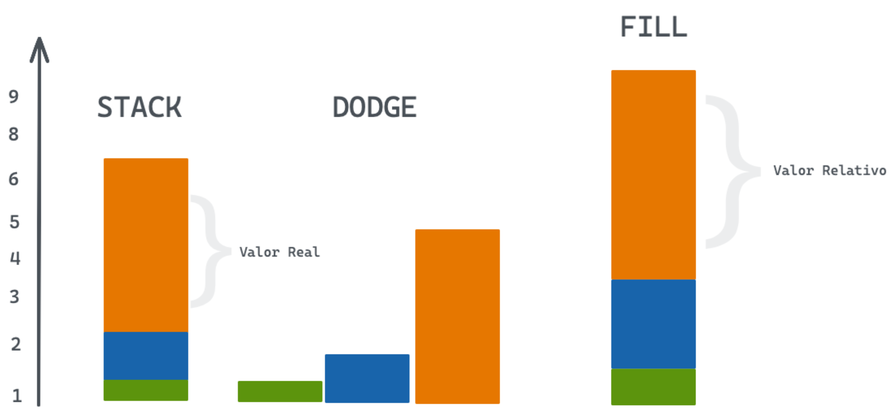

```{r setup, include=FALSE}

options(htmltools.dir.version = FALSE,
        tibble.max_extra_cols = 6,
        tibble.width = 60)

knitr::opts_chunk$set(warning = FALSE,
                      message = FALSE,
                      fig.align = "center",
                      dpi = 400,
                      out.width = "95%",
                      out.height = "95%",
                      fig.retina = 3)
library(ggplot2)
library(datos)
library(scales)
library(forcats)
```


```{r xaringanExtra-clipboard, echo=FALSE}
htmltools::tagList(
  xaringanExtra::use_clipboard(
    button_text = "<i class=\"fa fa-clipboard\"></i>",
    success_text = "<i class=\"fa fa-check\" style=\"color: #90BE6D\"></i>",
    error_text = "<i class=\"fa fa-times-circle\" style=\"color: #F94144\"></i>"
  ),
  rmarkdown::html_dependency_font_awesome()
)
```

```{r xaringan-themer, include=FALSE, warning=FALSE}
library(xaringanthemer)
style_mono_accent(
  title_slide_background_color = "white",
  title_slide_text_color = "#5E8B7E",
  header_h1_font_size = "45px",
  header_h2_font_size = "35px",
  header_color = "#5E8B7E",
  inverse_background_color = "#9FB8AD",
  text_bold_color = "#5E8B7E",
  text_bold_font_weight = "700",
  code_inline_color = "#B4C6A6",
  text_font_size = "28px",
  code_font_size = "24px",
  code_highlight_color = "#F7EFB2",
  header_font_google = google_font("Lora", "300", "300i",
                                   "400","400i", "700","700i"),
  text_font_google   = google_font("Montserrat", "300", "300i","700"),
  code_font_google   = google_font("Fira Code"),
  outfile = "css/style.css",
  extra_css = list("h1,h2,h3" = list("font-style" = "italic;"))
)
```

```{r metathis, echo=FALSE}
library(metathis)
meta() %>%
  meta_name("github-repo" ="aguerodev/presentacion_ggplot2") %>% 
  meta_social(
    title = "Introducción a ggplot2",
    description = paste(
      "Introducción a la gramática de los gráficos,",
      "desde 0 hasta gráficos listos para publicar."
    ),
    url = "https://aguerodev.github.io/presentacion_ggplot2",
    image = "img/om_image.jpeg",
    og_type = "website",
    og_author = "Carlos Agüero B",
    twitter_card_type = "summary_large_image",
    twitter_creator = "@dev_aguero",
    twitter_site = "@dev_aguero"
  )
```

class:left, middle, title-slide

# `r rmarkdown::metadata$title`

## `r rmarkdown::metadata$subtitle`

<br>

<div style = "position: absolute;top:80px;right: 10px;"></img><br>
<a href = "https://twitter.com/allison_horst" style = "font-size:16px;position: absolute;right: 10px;">Art by @allison_horst</a></div>

---
class: left, middle

# ¿Qué es una gramática?

La gramática tiene un significado técnico en lingüística. En la teoría transformacional de *Chomsky (1956)*, una gramática es un sistema formal de reglas para generar enunciados lícitos en una lengua.

---
class: left, middle

Un lenguaje compuesto por palabras y sin gramática (enunciado = palabra) sólo expresa **tantas ideas como palabras tiene**. Al especificar cómo se combinan las palabras en los enunciados, una gramática amplía el alcance de un lenguaje.

---
class: left, middle

Antes en R usabamos **plots (palabras)**, es decir, podiamos generar tantos gráficos como funciones estuvieran disponibles (no muchas).

```{r, eval=FALSE}
plot(...) # dispersion
barplot(...) # barras
pie(...) # pastel
hist(...) # histogramas
```


---
class: left, middle

Ahora tenemos una gramática que nos permite expresarnos de forma más fluida.

```{r, eval=FALSE}
ggplot(data = iris,
       mapping = aes(x = Sepal.Length,
                     y = Petal.Length,
                     color = Species)) +
  geom_point()
```

---
class: left, middle

.pull-left[
En **ggplot2** definimos nuestros gráficos como la unión una seria de capas entre las que tenemos:
]

.pull-right[

+ Datos
+ Geometrías (geom)
+ Estadísticos (stats)
+ Escalas (scales)
+ Coordenadas (coord)
+ Facetas (facets)
+ Etiquetas (labs)
+ Temas (themes)
]

---
class: left, middle

## Vamos poco a poco


---
class: left, middle

# Datos

---
class: left, middle

Trabajemos con una pequeña tabla muy conocida, .

```{r, echo=FALSE}
library(gt)
gt(head(flores)) %>% 
  tab_options(table.font.size = 28,
              column_labels.font.weight = "500")
```

---
class: left

.pull-left[
```{r, ggplot-1, eval=FALSE}
ggplot(data = flores)
```

Vamos a iniciar con la **capa de datos**,
cuando ejecutamos `ggplot(data = flores)` estamos indicando que estos son los datos con los que vamos a trabajar.

Vemos que el resultado es un lienzo gris, en donde más adelante dibujaremos nuestro gráfico.
]

.pull-right[
```{r ref.label="ggplot-1", fig.callout=TRUE, echo=FALSE, dev='svglite'}
``` 
]

---
class: left, middle

# Mapeo

---
class: left
El mapeo indica que codificación visual vamos a utilizar, es decir, que medio vamos a utilizar para representar nuestros datos, entre algunos de estos canales tenemos:

<center>
</img>
</center>

---
class: left

.pull-left[
```{r, eval=FALSE}
ggplot(
  data = flores,
  mapping = aes(
    x = Largo.Sepalo, #<<
    y = Largo.Petalo,
    color = Especies
  )
)
```

Utilizando la función `aes` definimos cómo se van a codificar visualmente nuestros datos.

]

.pull-right[
```{r, echo=FALSE}
library(gt)
library(dplyr)

head(flores) %>% 
select(-contains("Ancho")) %>% 
gt() %>% 
   tab_spanner(
    label = "Eje x",
    columns = c(`Largo.Sepalo`)
  ) %>% 
  tab_spanner(
    label = "Eje y",
    columns = c(`Largo.Petalo`)
  ) %>% 
  tab_spanner(
    label = "Color",
    columns = c(`Especies`)
  ) %>% 
  tab_style(
    style = cell_fill(color = "#F7EFB2"),
    locations = cells_body(
      columns = "Largo.Sepalo"
  )) %>% 
  tab_style(
    style = cell_fill(color = "#F7EFB2"),
    locations = cells_column_labels(
      columns = "Largo.Sepalo"
  )) %>% 
  tab_style(
    style = cell_fill(color = "#F7EFB2"),
    locations = cells_column_spanners(
      spanners = "Eje x"
  )) %>% 
   tab_options(table.font.size = 28,
               column_labels.font.size = "30")
```

]

---
class: left

.pull-left[
```{r, eval=FALSE}
ggplot(
  data = flores,
  mapping = aes(
    x = Largo.Sepalo,
    y = Largo.Petalo, #<<
    color = Especies
  )
)
```

]

.pull-right[
```{r, echo=FALSE}
library(gt)
library(dplyr)

head(flores) %>% 
select(-contains("Ancho")) %>% 
gt() %>% 
   tab_spanner(
    label = "Eje x",
    columns = c(`Largo.Sepalo`)
  ) %>% 
  tab_spanner(
    label = "Eje y",
    columns = c(`Largo.Petalo`)
  ) %>% 
  tab_spanner(
    label = "Color",
    columns = c(`Especies`)
  ) %>% 
  tab_style(
    style = cell_fill(color = "#F7EFB2"),
    locations = cells_body(
      columns = "Largo.Petalo"
  )) %>% 
  tab_style(
    style = cell_fill(color = "#F7EFB2"),
    locations = cells_column_labels(
      columns = "Largo.Petalo"
  )) %>% 
  tab_style(
    style = cell_fill(color = "#F7EFB2"),
    locations = cells_column_spanners(
      spanners = "Eje y"
  )) %>% 
   tab_options(table.font.size = 28,
               column_labels.font.size = "30")
```

]


---
class: left

.pull-left[
```{r, eval=FALSE}
ggplot(
  data = flores,
  mapping = aes(
    x = Largo.Sepalo,
    y = Largo.Petalo,
    color = Especies #<<
  )
)
```

]

.pull-right[
```{r, echo=FALSE}
library(gt)
library(dplyr)

head(flores) %>% 
select(-contains("Ancho")) %>% 
gt() %>% 
   tab_spanner(
    label = "Eje x",
    columns = c(`Largo.Sepalo`)
  ) %>% 
  tab_spanner(
    label = "Eje y",
    columns = c(`Largo.Petalo`)
  ) %>% 
  tab_spanner(
    label = "Color",
    columns = c(`Especies`)
  ) %>% 
  tab_style(
    style = cell_fill(color = "#F7EFB2"),
    locations = cells_body(
      columns = "Especies"
  )) %>% 
  tab_style(
    style = cell_fill(color = "#F7EFB2"),
    locations = cells_column_labels(
      columns = "Especies"
  )) %>% 
  tab_style(
    style = cell_fill(color = "#F7EFB2"),
    locations = cells_column_spanners(
      spanners = "Color"
  )) %>% 
   tab_options(table.font.size = 28,
               column_labels.font.size = "30")
```

]
 

 
 
---
class:left 

.pull-left[
```{r, ggplot-2, eval=FALSE}
ggplot(
  data = flores,
  mapping = aes(
    x = Largo.Sepalo,
    y = Largo.Petalo,
    color = Especies
  )
)
```

Tenemos como resultado un pequeño gráfico en donde ya tenemos valores definidos para los ejes `x,y`.
]

.pull-right[
```{r ref.label="ggplot-2", fig.callout=TRUE, echo=FALSE, dev='svglite'}
``` 

]

---
class: middle, left 

# Geometrías

---
class: middle, center

<center>
</img>
</center>


---
class:left 

.pull-left[
```{r, ggplot-3, eval=FALSE}
ggplot(
  data = flores,
  mapping = aes(
    x = Largo.Sepalo,
    y = Largo.Petalo,
    color = Especies
  )) +
  geom_point() #<<
```

Usamos el operador `+` para **unir las capas de nuestro gráfico**.

Con la función `geom_point()` vamos a especificar que queremos que las observaciones de nuestra tabla se "dibujen" como puntos en el plano.

]

.pull-right[
```{r ref.label="ggplot-3", fig.callout=TRUE, echo=FALSE, dev='svglite'}
``` 

]

---
class: middle, left

## Podemos consultas todas las geometrías en la [documentación del paquete](https://ggplot2.tidyverse.org/reference/). 


---
class: middle, left

## Veamos ahora algunos ejemplos

---
class: left

Tenemos los siguiente datos, ahora queremos saber como se distribuye la variable **estado_civil**.

```{r, echo=FALSE}
head(encuesta) %>% 
  select(edad, estado_civil,raza,religion,
         horas_tv) %>% 
  gt() %>% 
   tab_options(table.font.size = 28,
               column_labels.font.size = "30")
```

---
class: left

.pull-left[
```{r, ggplot-4, eval=FALSE}
ggplot(
  data = encuesta #<<
)
```

1. **Definimos la capa de datos**

]

.pull-right[
```{r ref.label="ggplot-4", fig.callout=TRUE, echo=FALSE, dev='svglite'}
``` 

]

---
class: left

.pull-left[
```{r, ggplot-5, eval=FALSE}
ggplot(
  data = encuesta, 
  mapping = aes(x = estado_civil) #<<
)
```

1. Definimos la capa de datos
2. **Definimos el mapeo**
  1. x = religion

]

.pull-right[
```{r ref.label="ggplot-5", fig.callout=TRUE, echo=FALSE, dev='svglite'}
``` 

]

---
class: left

.pull-left[
```{r, ggplot-6, eval=FALSE}
ggplot(
  data = encuesta, 
  mapping = aes(x = estado_civil)
) +
  geom_bar() #<<
```

1. Definimos la capa de datos

2. Definimos el mapeo
  1. x = religion
    
3. **Agregamos una geometría**

]

.pull-right[
```{r ref.label="ggplot-6", fig.callout=TRUE, echo=FALSE, dev='svglite'}
``` 

]

---
class: middle, center

```{r ref.label="ggplot-6", fig.callout=TRUE, echo=FALSE, dev='svglite', fig.asp=9/16}
``` 

---
class: left

.pull-left[
```{r, ggplot-7, eval=FALSE}
ggplot(
  data = encuesta, 
  mapping = aes(x = estado_civil)
) +
  geom_bar() +
  labs( #<<
    x = "Estado Civil",
    y = "Cantidad",
    title = "Cantidad de encuestados por estado civil",
    caption = "Fuente: Te lo juro por Dieguito maradona."
  )
```

]

.pull-right[
```{r ref.label="ggplot-7", fig.callout=TRUE, echo=FALSE, dev='svglite'}
``` 

]

---
class: middle, center

```{r ref.label="ggplot-7", fig.callout=TRUE, echo=FALSE, dev='svglite', fig.asp=9/16}
``` 


---
class: left

.pull-left[
```{r, ggplot-9, eval=FALSE}
ggplot(
  data = encuesta, 
  mapping = aes(x = estado_civil)
) +
  geom_bar() + 
  labs(
    x = "Estado Civil",
    y = "Cantidad",
    title = "Cantidad de encuestados por estado civil",
    caption = "Fuente: Te lo juro por Dieguito maradona."
  ) +
  theme_minimal() #<<
```

]

.pull-right[
```{r ref.label="ggplot-9", fig.callout=TRUE, echo=FALSE, dev='svglite'}
``` 

]

---
class: middle, center

```{r ref.label="ggplot-9", fig.callout=TRUE, echo=FALSE, dev='svglite', fig.asp=9/16}
``` 


---
class: middle, center

## Muy bien ya tenemos un gráfico y todo parece un poco...

</img>

---
class: middle, center

## Pero hay un par de cosas que aun debemos entender del gráfico anterior.


---
class: middle, center


---
class: middle, center

</img>

---
class: left

.pull-left[
```{r, ggplot-10, eval=FALSE}
ggplot(
  data = encuesta, 
  mapping = aes(x = estado_civil)) +
geom_bar()
```

</img>

]

.pull-right[

```{r ref.label="ggplot-10", fig.callout=TRUE, echo=FALSE, dev='svglite'}
``` 

]


---
class: left

.pull-left[
Le pasamos a `StatCount` esto:

```{r, echo=FALSE}
data.frame(x = encuesta$estado_civil) %>% 
  head() %>% 
  gt() %>% 
   tab_options(table.font.size = 20,
               column_labels.font.size = "20") %>% 
  cols_align(
  align = "left",
  columns = everything()
)
```
]
.pull-right[
Y nos regresa esto:
```{r, echo=FALSE}
bars <- readRDS("data/barras_statCount.rds")
bars$prop <- round(bars$prop,4)
bars %>% 
  gt() %>% 
   tab_options(table.font.size = 20,
               column_labels.font.size = "20",
               table.align = "left") %>% 
  cols_align(
  align = "left",
  columns = everything()
)
```
]


---
class: left

.pull-left[
```{r, ggplot-11, eval=FALSE}
ggplot(
  data = encuesta, 
  mapping = aes(x = estado_civil)) +
geom_bar() +
geom_text(
  mapping = aes(
    label = after_stat(count) #<<
  ), 
  stat = "count") 
```

La función `after_stat()` nos permita usar los valores que calculan los stats.

]

.pull-right[

```{r ref.label="ggplot-11", fig.callout=TRUE, echo=FALSE, dev='svglite'}
``` 

]

---
class: left

.pull-left[
```{r,eval=FALSE}
ggplot(
  data = encuesta, 
  mapping = aes(x = estado_civil)) +
geom_bar() +
geom_text(
  mapping = aes(
    label = after_stat(count) 
  ), 
  stat = "count") #<<
```

Debemos indicar que vamos a usar el stat `count`.
]

.pull-right[

```{r ref.label="ggplot-11", fig.callout=TRUE, echo=FALSE, dev='svglite'}
``` 

]


---
class: middle, left 

### Imagina que ahora lo que queremos ver es el `estado civil` por `raza`, para esto podemos usar el color.

---
class: left

.pull-left[
```{r, ggplot-12, eval=FALSE}
ggplot(
  data = encuesta, 
  mapping = aes(
    x = estado_civil,
    fill = raza, #<<
  )) +
geom_bar() +
geom_text(
  mapping = aes(
    label = after_stat(count) 
  ), 
  stat = "count") 
```
]
.pull-right[

```{r ref.label="ggplot-12", fig.callout=TRUE, echo=FALSE, dev='svglite'}
``` 
]

---
class: middle, center

```{r ref.label="ggplot-12", fig.callout=TRUE, echo=FALSE, dev='svglite', fig.asp=9/16}
``` 

---
class: middle, left

### Los `stats` calculan lo que hace falta para dibujar las geometrías.

### El atributo `position` calcula como hay que ordenarlos en la pantalla.


---
class: middle, left

<center>
</img>
</center>

---
class: left

.pull-left[
```{r, ggplot-13, eval=FALSE}
ggplot(
  data = encuesta, 
  mapping = aes(
    x = estado_civil,
    fill = raza, 
  )) +
geom_bar() +
geom_text(
  mapping = aes(
    label = after_stat(count) 
  ), 
  position = position_stack( #<<
    vjust = 0.5 #<<
  ), #<<
  stat = "count") 
```
]
.pull-right[

```{r ref.label="ggplot-13", fig.callout=TRUE, echo=FALSE, dev='svglite'}
``` 
]

---
class: middle, center

<center>
</img>
</center>

---
class: left

.pull-left[
```{r, ggplot-14, eval=FALSE}
ggplot(
  data = encuesta, 
  mapping = aes(
    x = estado_civil,
    fill = raza, 
  )) +
  geom_bar(
    position = position_dodge() #<<
  ) +
  geom_text(
    mapping = aes(
      label = after_stat(count) 
    ), 
    position = position_dodge(#<<
      width = 0.9#<<
    ), #<<
    stat = "count") 
```
]
.pull-right[

```{r ref.label="ggplot-14", fig.callout=TRUE, echo=FALSE, dev='svglite'}
``` 
]

---
class: left

.pull-left[
```{r, ggplot-15, eval=FALSE}
ggplot(
  data = encuesta, 
  mapping = aes(
    x = estado_civil,
    fill = raza, 
  )) +
  geom_bar(
    position = position_fill()#<<
  ) +
  geom_text(
    mapping = aes(
      label = after_stat(count) 
    ), 
    position = position_fill(#<<
      vjust = 0.5#<<
    ), #<<
    stat = "count") 
```
]
.pull-right[

```{r ref.label="ggplot-15", fig.callout=TRUE, echo=FALSE, dev='svglite'}
``` 
]

---
class: left, middle

### Es algo complicado leer el gráfico con los textos en el `eje x`, para leerlo mejor podemos moverlos al `eje y`.

---
class: left

.pull-left[
```{r, ggplot-16, eval=FALSE}
ggplot(
  data = encuesta, 
  mapping = aes(
    y = estado_civil, #<<
    fill = raza, 
  )) +
  geom_bar(
    position = position_fill()
  ) +
  geom_text(
    mapping = aes(
      label = after_stat(count) 
    ), 
    position = position_fill(
      vjust = 0.5
    ), 
    stat = "count") 
```
]
.pull-right[

```{r ref.label="ggplot-16", fig.callout=TRUE, echo=FALSE, dev='svglite'}
``` 
]


---
class: middle, left

### `Scales`, poniendo ggplot2 en modo manual

<center>
</img>
</center>


---
class: left

.pull-left[
```{r, ggplot-17, eval=FALSE}
ggplot(
  data = encuesta, 
  mapping = aes(
    y = estado_civil, fill = raza, 
  )) +
  geom_bar(
    position = position_fill()
  ) +
  geom_text(
    mapping = aes(
      label = after_stat(count) 
    ), 
    position = position_fill(
      vjust = 0.5
    ), stat = "count") +
  scale_x_continuous( #<<
    labels = percent_format() #<<
  ) #<<
```
]
.pull-right[

```{r ref.label="ggplot-17", fig.callout=TRUE, echo=FALSE, dev='svglite'}
``` 
]

```{r, echo=FALSE}
g <- ggplot(
  data = encuesta, 
  mapping = aes(
    y = estado_civil, fill = raza, 
  )) +
  geom_bar(
    position = position_fill()
  ) +
  geom_text(
    mapping = aes(
      label = after_stat(count) 
    ), 
    position = position_fill(
      vjust = 0.5
    ), stat = "count") +
  scale_x_continuous( #<<
    labels = percent_format() #<<
  ) #<<
```

---
class: left

.pull-left[
```{r, ggplot-18, eval=FALSE}
g +
  scale_fill_manual(
    values = c("#2F86A6",
               "#FFCE45",
               "#34BE82")
  )
```
]
.pull-right[

```{r ref.label="ggplot-18", fig.callout=TRUE, echo=FALSE, dev='svglite'}
``` 
]

```{r, echo=FALSE}
g <- g +
  scale_fill_manual(
    values = c("#2F86A6",
               "#FFCE45",
               "#34BE82")
  )
```

---
class: middle, left

### `themes`, cambio de look al instante

<center>
</img>
</center>

---
class: left

.pull-left[
```{r, ggplot-22, eval=FALSE}
g
```
]
.pull-right[

```{r ref.label="ggplot-22", fig.callout=TRUE, echo=FALSE, dev='svglite'}
``` 
]

---
class: left

.pull-left[
```{r, ggplot-19, eval=FALSE}
g +
  theme_minimal()
```
]
.pull-right[

```{r ref.label="ggplot-19", fig.callout=TRUE, echo=FALSE, dev='svglite'}
``` 
]

---
class: left

.pull-left[
```{r, ggplot-20, eval=FALSE}
g +
  theme_classic()
```
]
.pull-right[

```{r ref.label="ggplot-20", fig.callout=TRUE, echo=FALSE, dev='svglite'}
``` 
]

---
class: left

.pull-left[
```{r, ggplot-21, eval=FALSE}
g +
  theme_dark()
```
]
.pull-right[

```{r ref.label="ggplot-21", fig.callout=TRUE, echo=FALSE, dev='svglite'}
``` 
]

---
class: middle, left

### Una pausa..

---
class: middle, left

### Ahora intentemos resolver este ejemplo.

---
class: left
Ahora tenemos una tabla con conteos.

```{r, echo=FALSE}
datos<- encuesta %>% 
  count(estado_civil, raza) %>% 
  group_by(estado_civil) %>% 
  summarise(raza, n, prop = n/sum(n), .groups = "drop")
```

```{r, echo=FALSE}
datos %>% 
  head() %>% 
  gt() %>% 
   tab_options(table.font.size = 20,
               column_labels.font.size = "20",
               table.align = "left") %>% 
  cols_align(
  align = "left",
  columns = everything())
```

---
class: left

.pull-left[
```{r, ggplot-23, eval=FALSE}
ggplot(
  data = datos,
  mapping = aes(
    y = estado_civil,
    x = prop,
    fill = raza
  )
) +
  geom_col() + #<<
  geom_text(mapping = aes(
    label = percent(prop,0.1)
  ),
  position = position_stack(0.5)
  ) +
  scale_x_continuous(
    labels = percent_format()
  )
```
]
.pull-right[

```{r ref.label="ggplot-23", fig.callout=TRUE, echo=FALSE, dev='svglite'}
``` 
]

---
class: left

.pull-left[
```{r, eval=FALSE}
geom_col()
```

Tengo valores para `x` y para `y`.
]
.pull-right[

```{r, eval=FALSE}
geom_bar()
``` 
Sólo tengo los valores de `x` y nesecito que StatCount calcule por mi el valor de `y`.
]

---
class: middle, left

### Ahora otras geometrías

---
class: left

.pull-left[
```{r, ggplot-24, eval=FALSE}
ggplot(
  data = encuesta,
  mapping = aes(
    x = raza,
    y = edad
  )
) +
  geom_boxplot()
  
```
]
.pull-right[

```{r ref.label="ggplot-24", fig.callout=TRUE, echo=FALSE, dev='svglite'}
``` 
]

---
class: left

.pull-left[
```{r, ggplot-25, eval=FALSE}
ggplot(
  data = encuesta,
  mapping = aes(
    x = edad,
    fill = raza
  )
) +
  geom_density(alpha = 0.7)
  
```
]
.pull-right[

```{r ref.label="ggplot-25", fig.callout=TRUE, echo=FALSE, dev='svglite'}
``` 
]

---
class: left, middle

### Facetas

---
class: left

.pull-left[
```{r, ggplot-26, eval=FALSE}
ggplot(
  data = encuesta,
  mapping = aes(
    y = cut_width(edad, 10), #<<
  )
) +
  geom_bar() +
  facet_wrap(~religion)
  
```
]
.pull-right[

```{r ref.label="ggplot-26", fig.callout=TRUE, echo=FALSE, dev='svglite'}
``` 
]

---
class: left

.pull-left[
```{r, ggplot-27, eval=FALSE}
ggplot(
  data = encuesta,
  mapping = aes(
    y = cut_width(edad, 10), #<<
  )
) +
  geom_bar() +
  facet_wrap(
    facets = ~fct_lump_n(#<<
      religion,
      n = 3,
      other_level = "Otras")
  )
  
```
]
.pull-right[

```{r ref.label="ggplot-27", fig.callout=TRUE, echo=FALSE, dev='svglite'}
``` 
]


---
class: middle, left

### Con esto ya podemos comenzar en el mundo de ggplot2.

---
class: left

Paquetes que debemos revisar

+ [forcats](https://forcats.tidyverse.org)
+ [scales](https://scales.r-lib.org)
+ [ggrepel](https://ggrepel.slowkow.com)
+ [patchwork](https://patchwork.data-imaginist.com)
+ [ggforce](https://ggforce.data-imaginist.com)